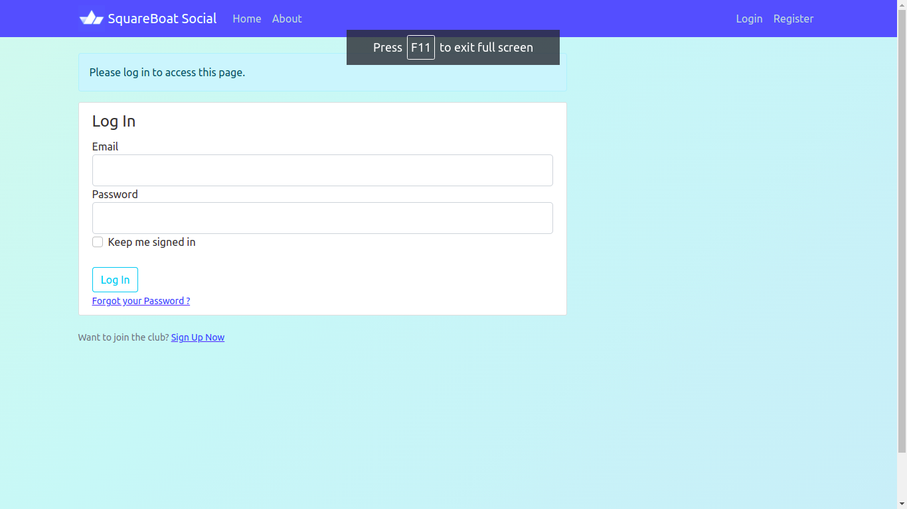
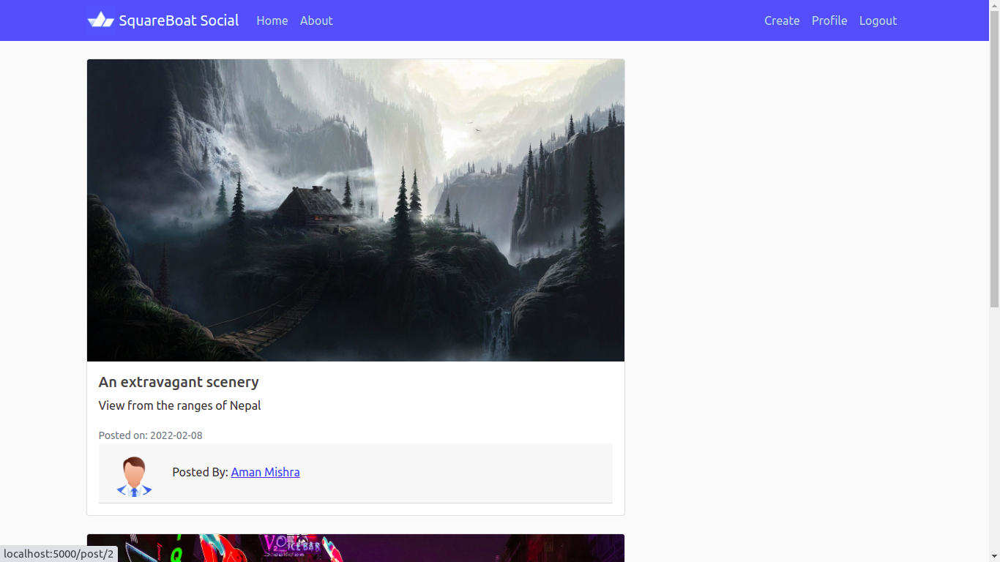
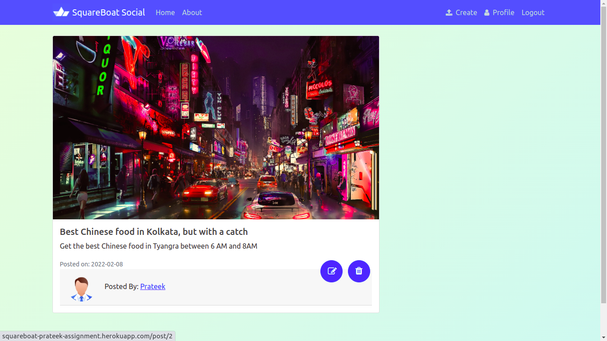
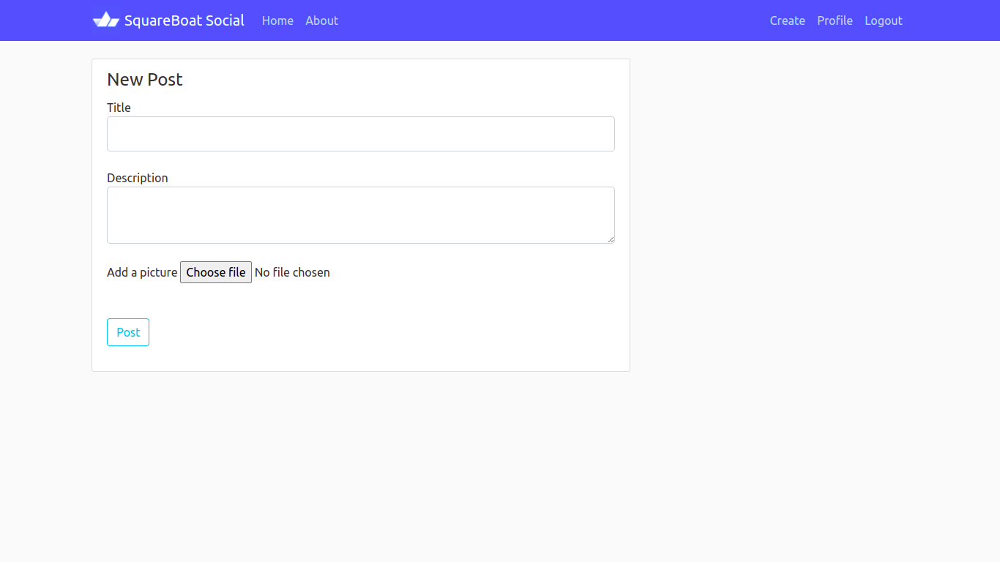
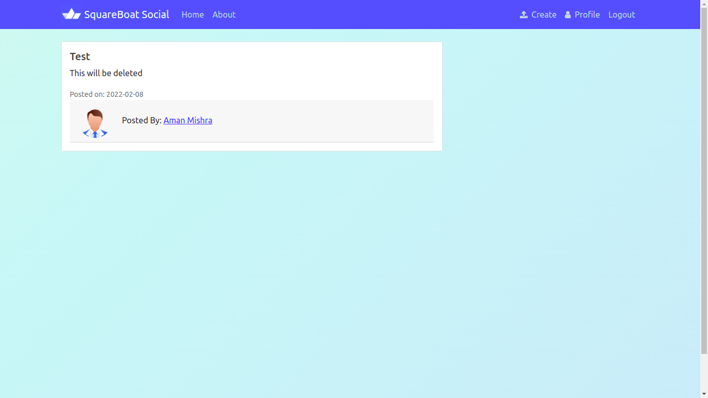

# Squareboat Assignment Documentation
This is the repository for the assignment task to be provided before 9th February 2021, 11 pm.

## Features included:
1. Added follower-following logic. You can navigate to a user's profile and follow/unfollow them. Only posts by users you follow will be visible.
2. Reset password if forgotten at login/register page.
3. Upload images to update display picture or post picture
4. Dockerized image has been pushed to heroku.
---

## Technical stack used:
* Python (Flask) used for backend.
* Since this is a dummy project the database used is a sqlite database.
* The frontend is using jinja template along with Bootstrap v5.0
* The project has been dockerized before pushing into production.
* Find the working web app here. Note: please refresh if you see the **"Nothing here page."** [Working web app link](https://squareboat-prateek-assignment.herokuapp.com)

### Please refer to the following screenshots for better navigation. 

---

### 1. Login Page: 

---

### 2. Home Page: 

---

### 3. See single post by User, with edit and delete options: 

---

### 4. Create a post: 

---

### 5. View a post by someone else: 

## To build this into a working app
* Run `docker build -t <name-of-choice> .` from the main directory